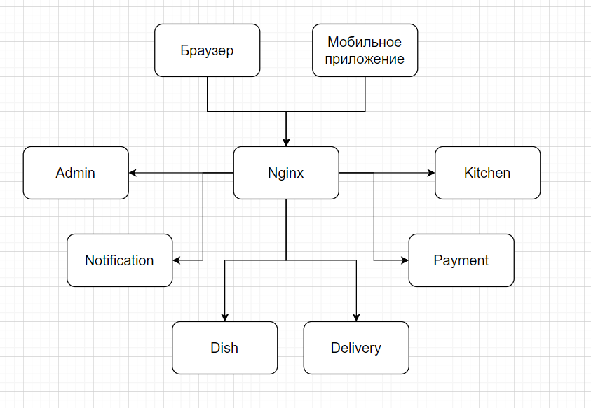

# job4j_fast_food

## Описание проекта

Блок микросервисы. Проект "Быстро и в точку".

Опишем желания заказчика.

- имеет каталог блюд

- может принимать заказы клиента на сайте. Либо через скачанное клиентами приложение

- предоставляет клиенту курьерскую доставку. Клиент может контролировать положение курьера

- предоставляет курьерам приложения, где они могут отчитываться о заказах, обновлять свое положение

- имеет админку в виде веб приложения, где можно оформлять поставки продуктов, а также видеть прибыль.

## Архитектура

## Контакты для связи
telegram: <a href="https://t.me/bekhterev_egor" target="blank">@bekhterev_egor</a>
